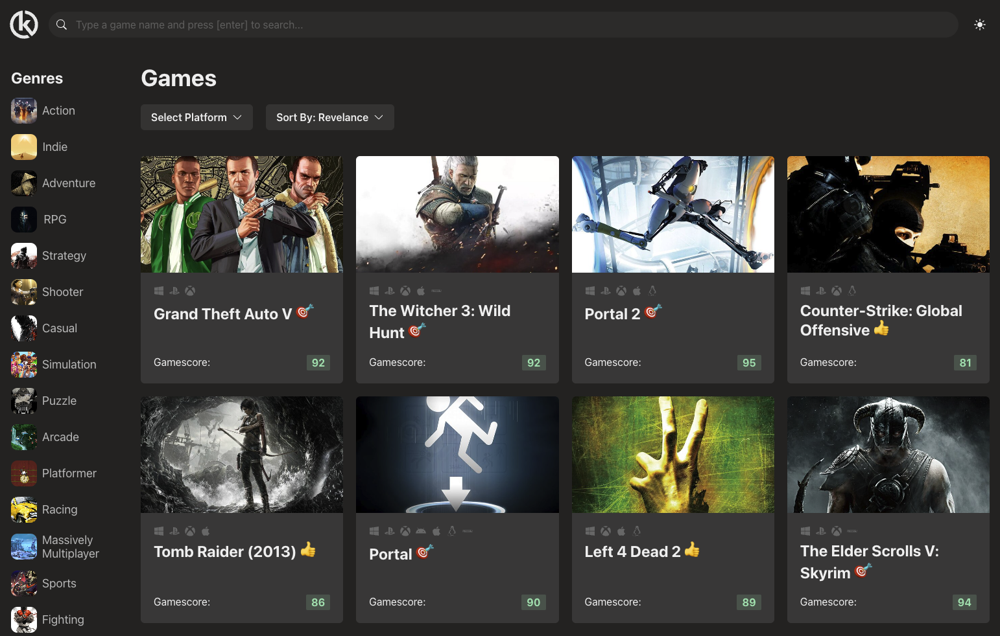
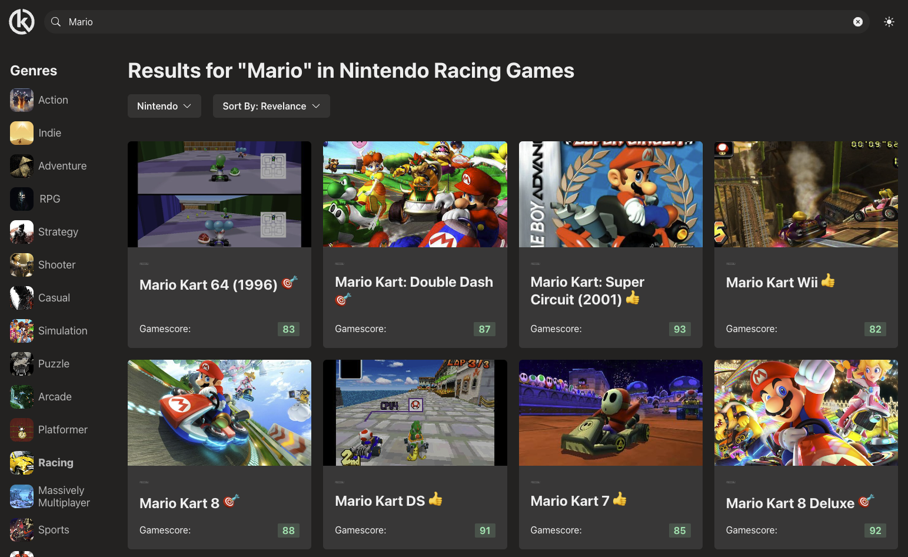

# GAMES HUB 

This is a personal project to showcase some React concepts and serve as a portfolio piece.

It is a *clone-ish* of the RAWG website, leverages their API to fetch game data.

## This project uses:

- **Vite**
- **Typescript**
- **React** - Custom Hooks, Contexts, Reducers, Custom Providers... exploring various patterns and techniques 🤔
- **Zustand** - Because useContext is a pain and Redux is overkill, but there’s still a custom context provider here for future reference.
- **ReactQuery** - Because we all like caching and keeps my API quota low.
- **Axios**
- **Chakra UI**
- **Framer Motion**
- **Infinite Scroll**

## Future improvements

- Maybe do a Next.js version, time will tell...

## Sugestions?

- Send me a pull request 😛

## Live Demo

Assuming I haven't blown my API quota, you can check out the [Live Demo](https://games-hub-phi.vercel.app/), hosted on Vercel.
